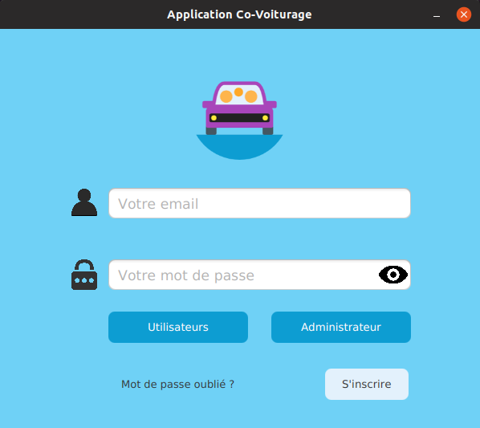
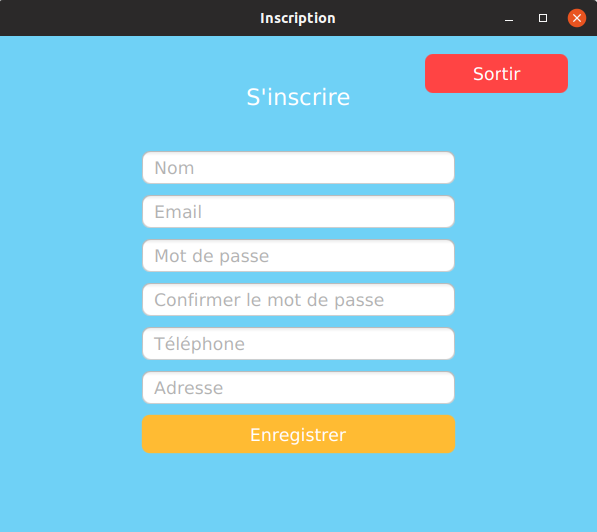
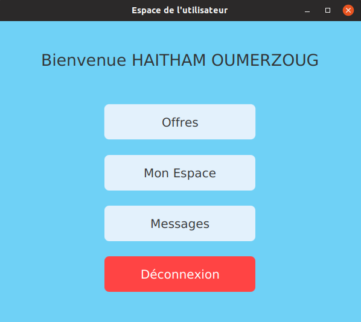
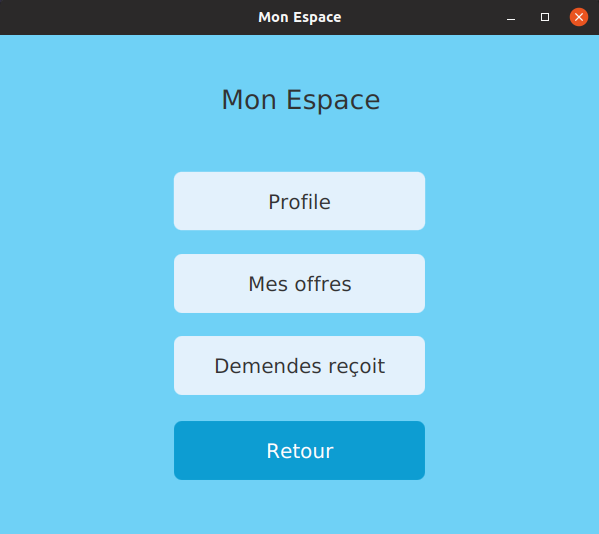

<h1 align="center">Co-voiturage</h1>
<h3 align="center">JavaFX Desktop application</h3>

## Introduction
Aujourd’hui la plupart des gens préfère de voyager par covoiturage, c'est-à-dire voyager en groupe par une ou plusieurs personnes qui veulent atteindre la même destination, sans qu’ils ne se connaissent déjà, cette méthode est plus économique que les transports publiques. Notre but est de réaliser une application qui va rendre ce processus plus léger et facile aux utilisateurs, elle permet de :     
1. Minimiser le coût de voyage.     
1. Faciliter de trouver le transport.     
1. Faire connaissance entre les gens.     
1. Avoir de la compagnie lors de voyage     
1. La lutte contre la pollution et à la préservation des ressources naturelle.

## Usage
1. Créer un nouveu projet JavaFx.
1. Installation est simple, via la commande :
```java
git clone https://github.com/HaithamOumerzoug/Co-voiturage.git
```
1. Ensuite, vous pouvez simplement exécuter le projet en tant qu'application Java.

## Inerface de l'application
* ### Login
<p align="left">
  
</p>

* ### Inscription
<p align="left">
  
</p>

* ### Interface Utilisateur
<p align="left">
  
</p>

* ### Espace Utilisateur
<p align="left">
  
</p>

